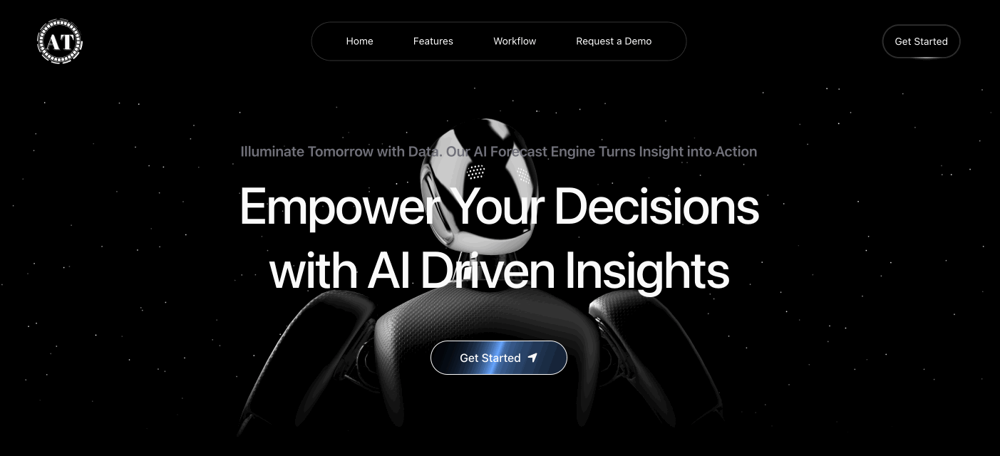
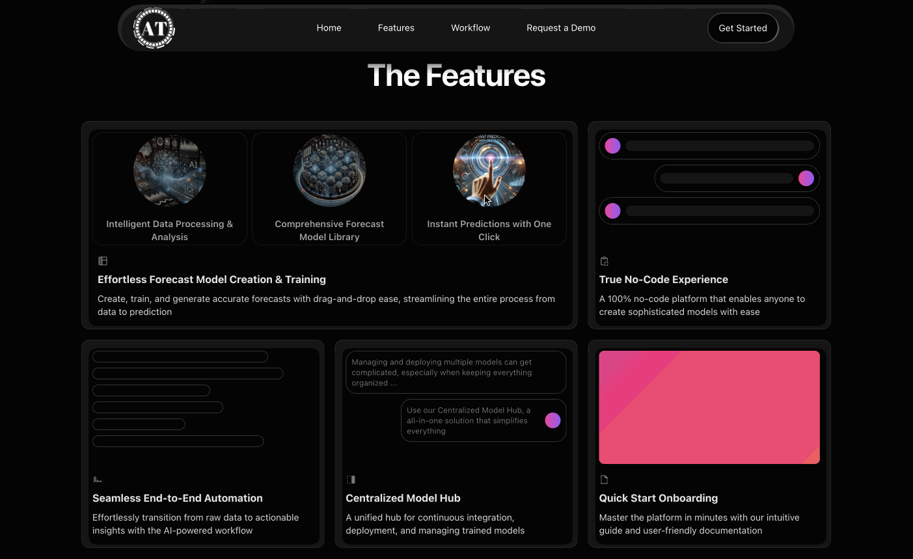
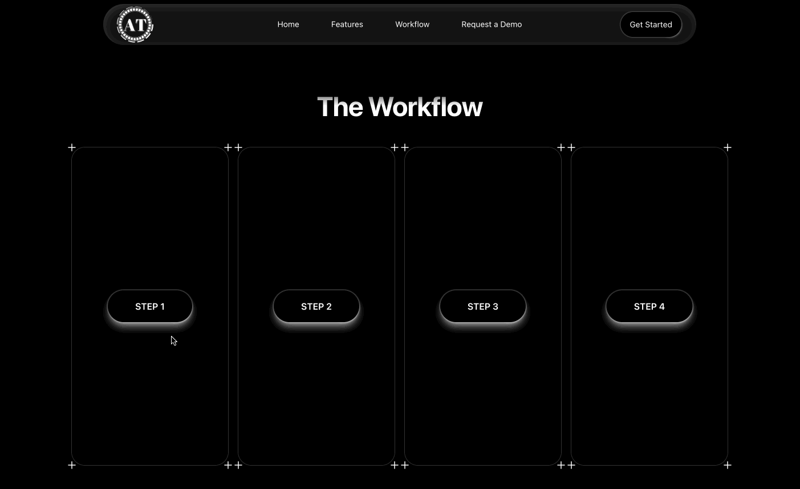

# 🤖 AI Landing Page

## Introduction

This is a template for creating a landing page for the AI product/project. It is built with Next.js and Tailwind CSS. The template includes the hero section, features section, and workflow section.

### Hero Section

### Features

### Workflow

## Running locally in development mode

To get started, just clone the repository and run `npm install && npm run dev`:

    git clone https://github.com/andyhou965/ai-landing-page.git
    npm install
    npm run dev

## Building and deploying in production

If you wanted to run this site in production, you should install modules then build the site with `npm run build` and run it with `npm start`:

    npm install
    npm run build
    npm start
